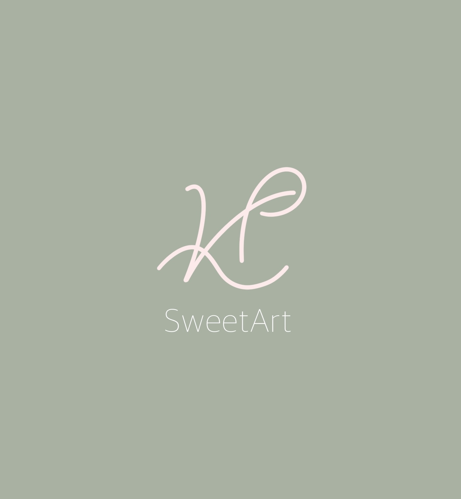

# kpsweetart.github.io
<!DOCTYPE html>
<html lang="es">
<head>
  <meta charset="UTF-8">
  <meta name="viewport" content="width=device-width, initial-scale=1.0">
  <title>kp.SweetArt</title>
  
</head>
<body>
  
  <h1>Bienvenidos a kp.SweetArt</h1>
  
Diseño gráfico que inspira dulzura y arte.

</body>
</html>
